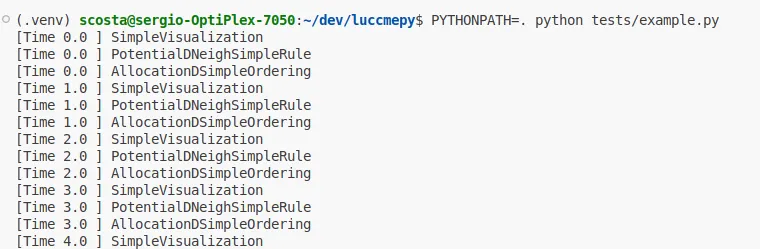
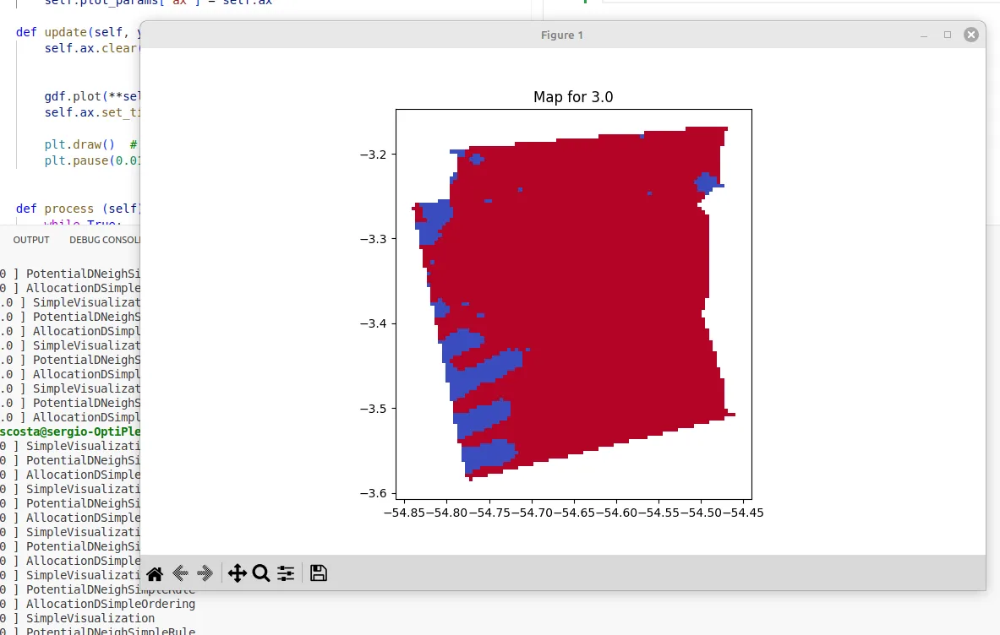

> rodar o codigo exemplo

~~~python
import geopandas as gpd
import pandas as pd

from luccmepy import  PotentialDNeighSimpleRule, SimpleVisualization,AllocationDSimpleOrdering, DemandPreComputedValues

import salabim as sim

env = sim.Environment()

file_name = Path(__file__).parent / "data" / "cs_moju.zip"
env.gdf = gpd.read_file(file_name)

env.landUseTypes = ["f", "d", "o"]
env.startTime = 2000
env.endTime = 2004 
env.cellarea = 1

env.potential = PotentialDNeighSimpleRule()

####################
## Demanda
####################
# pode ser carregada de um arquivo csv, ou criada manualmente

# Caminho do arquivo de demanda
csv_path = Path(__file__).parent / "data" / "moju_annual_demand.csv" 

env.demand = DemandPreComputedValues(
        annualDemand=pd.read_csv(csv_path, index_col="Year")
)

env.allocation = AllocationDSimpleOrdering()

env.visualization = SimpleVisualization(
    plot_params={
        "column": "f",
        "cmap": "coolwarm",
    })

env.run(till=env.endTime-env.startTime)

~~~

dado csv com as demandas pre computadas

~~~csv
Year,f,d,o
1999,5706,205,3
2000,5658,253,3
2001,5611,300,3
2002,5563,348,3
2003,5516,395,3
2004,5468,443,3
~~~

Executando

> PYTHONPATH=. python tests/example.py
> PYTHONPATH=. pytest tests/basic.py

Resultados

