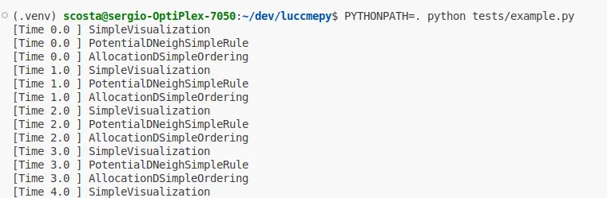
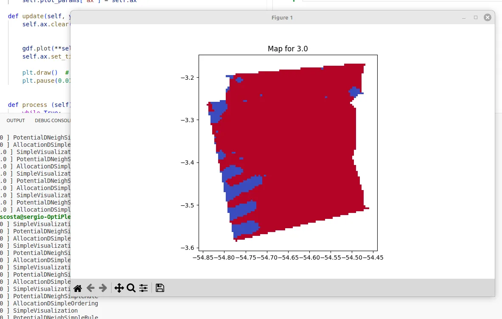

> rodar o codigo exemplo

~~~python
env = sim.Environment()

file_name = Path(__file__).parent / "data" / "cs_moju.zip"
env.gdf = gpd.read_file(file_name)

env.landUseTypes = ["f", "d", "o"]

PotentialDNeighSimpleRule()

AllocationDSimpleOrdering()

SimpleVisualization(
    plot_params={
        "column": "f",
        "cmap": "coolwarm",
    }
)

env.run(till=12)
~~~

Executando

> PYTHONPATH=. python tests/example.py

Resultados

